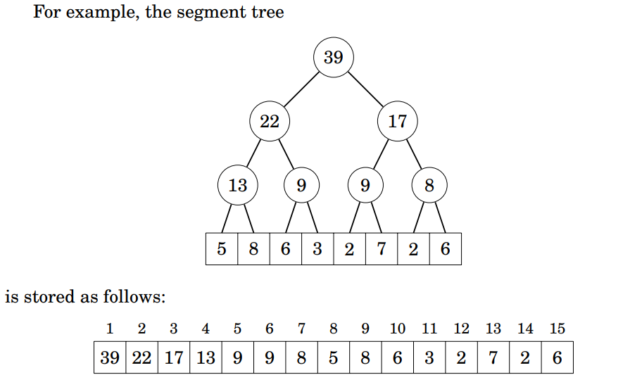

# Seg Tree

Complexidade: 
- Processamento (update e sum): **O(log n)**
- Construção: **O(n)**
- Memória: **O(4*n)**

(Fonte: Competitive Programmer's Handbook)[https://cses.fi/book/book.pdf]

Seg Tree é a **GOAT das estruturas de dados** para *range queries*, pois, ao contrário do prefix sum, que calcula o range da soma entre dois pontos (a, b) de um vetor, a seg tree nos possibilita:

- Calcular MUITAS outras coisas diferentes, como **min, max, e bitwise operations**
- Atualizar valores sem custo excessivo de tempo (as chamadas *dynamic queries*)

# Estrutura

A seg tree, mesmo chamada de tree, é, muitas da vezes, representada por um vetor de tamanho **4*n**, onde temos, para cada elemento k:

- `filhoEsq(k) = tree[2k]` 
- `filhoDir(k) = tree[2k+1]`
- `pai(k) = tree[k/2]`

**Nota: k/2 = floor(k/2), mas int já trunca pra baixo*

---

### Problema Relacionado e Código do Algoritmo

Veja: segTree.cpp