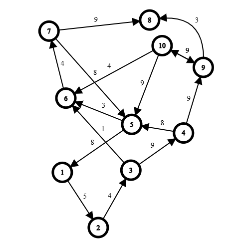

# Dijkstra

Complexity: 
- Processing: **O((N + M) * log N)**
- Memory: **O(N + M)**

_Where **N** is the qtd. of nodes and **M** is the qtd. of edges_

---

_Note: It is recommended to see a graphic illustration of the algorithm, to do so, [This video can help a lot!](https://www.youtube.com/watch?v=EFg3u_E6eHU&t=384s)_

On a **weighted graph problem**, Dijkstra is a **Shortest path algorithm** between a node A to a node B

Its implementation is greatly understandable when seen visually, but in sum, given a set of:
- Nodes (e.g. cities or computer in a network)
- Weighted Edges (e.g. time to travel from city A to B) 

We can find an optmized route with the use of a vector called **distances from A** (or`dist[]`), that, from edge to edge, updates certain values that say what is the minimum cost to go from node A to a node X (Not necessarily to node B)

Take this weighted directed graph as an example:



If we start at node 1, we have the table `dist[]` which saves the distances from node 1 to all other nodes:

| Nodo | 1 | 2 | 3 | 4 | 5 | 6 | 7 | 8 | 9 | 10|
|------|---|---|---|---|---|---|---|---|---|---|
| Dist | 0 | 5 | 9 | 18| 22| 10| 14| 23| 27|31 |


Small implementations are used in the algorithm, such as **priority queues** to optimize edge choosing (using cheaper travel costs is always better) and two vectors: `adj[]` and `dist[]`

```cpp

// Saving the graph as an adjacency list:
vector<pair<ll, int>>adj[n];
vector<ll>dist(n, 1e18); // All values must start at infinity/big value

/* EXAMPLE 
adj[1] = {(6, 2), (2, 3), (4, 3)}
adj[2] = {}
adj[3] = {(3, 2)}
Where each pair is a flight of type (time to travel, destiny)
*/

void dijkstra(int start){
    
    priority_queue<pair<ll, int>> pq;
    // priority queues prioritize greater values, but since we need to use the smallest edge, we can just pass 
    // The distances as negative values

    pq.emplace(0, start);
    while(!pq.empty()){
        auto [cost, current] = pq.top();
        pq.pop();

        for(auto [time, destiny] : adj[current]){
            if(cost + time < dist[destiny]){
                // Found an optmization!
                dist[destiny] = cost + time;
                pq.emplace(-dist[destiny], destiny);
            }
        }
    }
}
```
**the neighbor file `dijkstra.cpp` has a cleaner code, and an example to test it**